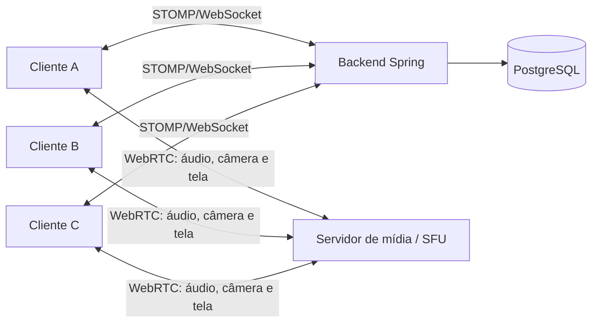
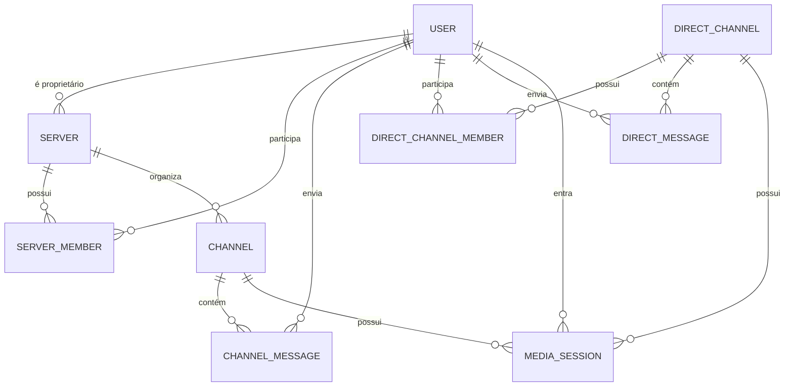

# LiveChat — visão do produto e direção técnica

Este documento é a referência viva para a evolução do LiveChat. Ele descreve o que existe hoje, o produto que queremos construir e as decisões que ainda precisam ser tomadas. Deve ser atualizado sempre que uma decisão de arquitetura ou de experiência mudar.

## Objetivo

Evoluir o backend atual para sustentar uma plataforma de comunicação em tempo real inspirada no uso de servidores e canais do Discord. O produto terá duas formas de conversa: servidores, que funcionam como grupos organizados em canais, e canais privados 1:1. Ambas suportarão mensagens e comunicação em tempo real por áudio, câmera e compartilhamento de tela.

O produto não precisa reproduzir todos os recursos do Discord. A intenção inicial é ter uma experiência simples e sólida de comunidades privadas: criar servidor, convidar ou adicionar membros, organizar canais e conversar com mídia em tempo real, inclusive em privado entre duas pessoas. A primeira versão é dimensionada para canais 1:1 e para até 5 participantes simultâneos em um canal de servidor.

## O que já existe

O projeto é uma aplicação Java 21 com Spring Boot 3.5, PostgreSQL, JPA, Spring Security, JWT e WebSocket/STOMP. Docker Compose sobe a aplicação, PostgreSQL, Redis e, no ambiente local, LiveKit.

As funcionalidades atuais são:

- cadastro, login, JWT de acesso e refresh token;
- recuperação e troca autenticada de senha por e-mail com token opaco de uso único, expiração configurável, invalidação dos refresh tokens e rejeição dos JWTs anteriores à troca;
- consulta, atualização confirmada e soft delete da própria conta; alterações de nome ou e-mail ficam pendentes até a confirmação enviada ao endereço anterior; ao desativar a conta, os dados pessoais são anonimizados e o histórico de mensagens é preservado;
- solicitações de amizade e lista de amigos, com eventos privados STOMP de criação, aceite e rejeição;
- mensagens persistidas em canais privados 1:1 e em canais `TEXT` de servidor;
- WebSocket nativo em `/ws`, com STOMP e autenticação por `Authorization: Bearer <JWT>` no frame `CONNECT`;
- envio STOMP para canais privados ou de servidor e recebimento em `/user/queue/messages` pelos participantes autorizados;
- servidores com proprietário e membros;
- canais de servidor dos tipos `TEXT` e `VOICE`;
- convites direcionados a amigos aceitos, com aceite explícito do destinatário e eventos privados STOMP de criação e aceite;
- listagem autorizada dos membros de cada servidor e evento `server.member.joined` após a entrada;
- canais privados 1:1 permanentes, com criação idempotente, listagem e consulta limitada aos dois participantes.
- presença efêmera de mídia em canais `VOICE` de servidor e em canais privados 1:1, com entrada, saída, troca atômica de canal, participantes atuais e estado de microfone, câmera e tela; cada canal de voz de servidor aceita até cinco participantes simultâneos;
- eventos STOMP de presença em `/user/queue/media-presence` para os participantes autorizados;
- Redis para manter sessões de presença e preservar o estado `reconnecting` por 30 segundos após uma desconexão inesperada;
- primeira fatia do LiveKit: servidor auto-hospedado no ambiente local e emissão, ao entrar em uma sessão, da URL pública, sala interna e credencial de acesso com expiração de cinco minutos.

Ainda não há transmissão de áudio, câmera ou tela pelo cliente: a infraestrutura e as credenciais de entrada no LiveKit estão disponíveis, mas o cliente ainda precisa conectar-se à sala, publicar suas faixas e consumir as faixas remotas.

As mensagens privadas que existiam antes dos canais 1:1 são migradas uma única vez na inicialização para o canal privado do respectivo par de usuários. A origem é mantida como referência interna de migração, evitando duplicação em reinicializações.

## Experiência desejada

1. Uma pessoa autenticada cria um **servidor** e se torna sua proprietária.
2. Ela cria canais dos tipos **voz** e **texto**.
3. Outras pessoas entram no servidor por um link de convite e confirmam que desejam participar.
4. Um membro seleciona um canal de voz e entra nele.
5. Os demais membros daquele canal recebem a mudança de presença e passam a ouvir e ver as mídias publicadas, com entrada e saída sem recarregar a página.
6. O membro pode ligar ou desligar câmera, silenciar o microfone, compartilhar uma tela ou janela e controlar os dispositivos de entrada e saída.
7. O membro pode sair do canal ou trocar de canal a qualquer momento.
8. Duas pessoas podem abrir ou retomar um **canal privado 1:1**, trocar mensagens e iniciar uma conversa de áudio, câmera ou tela sem criar ou entrar em um servidor.

Na primeira versão, as permissões podem ser simples: proprietário e membro. Papéis, cargos, moderação, gravação e vídeo em alta escala ficam fora do escopo inicial.

## Decisões consolidadas

| Tema | Decisão |
| --- | --- |
| SFU | Usar **LiveKit auto-hospedado**. O servidor é open source sob licença Apache 2.0 e atende áudio, câmera, tela, salas e credenciais de acesso. Não haverá custo de licença ou de serviço gerenciado. |
| Salas e credenciais | Nomes de sala são internos e usam os prefixos `server-voice-` e `direct-`. O token expira em cinco minutos, usa o UUID do usuário como identidade e permite entrar, publicar e assinar somente a sala autorizada, sem data channel. As credenciais aparecem apenas na resposta de entrada; listas e eventos continuam expondo somente a sessão de mídia. |
| Custo de mídia | O software será gratuito, mas a operação em produção exigirá hospedagem, IP público, domínio/TLS e consumo de banda. Em desenvolvimento, LiveKit pode rodar localmente sem custo. |
| Entrada no servidor | Um membro convida diretamente um amigo com amizade aceita. O destinatário lista o convite e confirma a ação em “Aceitar convite”. Apenas essa confirmação adiciona a pessoa ao servidor. |
| Canal de mídia ativo | Cada usuário pode participar de somente um canal de voz por vez. Ao entrar em outro canal, o sistema sai do anterior de forma atômica. |
| Reconexão | A presença será preservada por 30 segundos após uma desconexão inesperada. Se o usuário retornar ao mesmo canal nesse prazo, a sessão será reativada; passado o prazo, a saída será definitiva. |
| Redis | Será incluído junto com a camada de mídia. Ele manterá sessões de mídia e reconexão com TTL de 30 segundos e poderá servir ao modo distribuído do LiveKit quando necessário. |
| Canais privados 1:1 | São conversas permanentes entre exatamente dois usuários, independentes de um servidor. Elas permitem mensagens, áudio, câmera e compartilhamento de tela em tempo real. Somente os dois participantes podem acessá-las. |
| Canais de texto | Fazem parte do modelo de servidor desde o início. As mensagens privadas atuais serão remodeladas como mensagens de canal privado 1:1; mensagens de grupos serão vinculadas a canais de texto do servidor. |
| Exclusão de conta | Usar soft delete: anonimizar nome, e-mail e credenciais, remover vínculos sociais ativos e memberships, mas preservar mensagens e canais privados como histórico. Servidores passam ao membro ativo mais antigo; sem sucessor, o servidor e suas dependências são removidos. |

## Conceitos de domínio

| Conceito | Responsabilidade |
| --- | --- |
| Usuário | Conta autenticada já existente no sistema. |
| Servidor | Espaço criado por um usuário que reúne membros e canais. Possui nome, proprietário e data de criação. |
| Membro do servidor | Vínculo entre usuário e servidor. Na primeira versão, guarda o papel de proprietário ou membro. |
| Convite | Registro direcionado a um amigo aceito, contendo servidor, remetente, destinatário e estado. Ele permite ingressar no servidor somente após a aceitação explícita do destinatário. |
| Canal | Recurso pertencente a um servidor. Terá nome, posição e tipo (`VOICE` ou `TEXT`). Um canal de voz comporta áudio, câmera e compartilhamento de tela; um canal de texto reúne mensagens persistidas. |
| Canal privado 1:1 | Conversa identificada por dois participantes únicos. Contém suas mensagens e mapeia para uma sala de mídia exclusiva enquanto uma chamada estiver ativa. |
| Sessão de mídia | Presença efêmera de um membro em um canal de voz. Não armazena áudio, vídeo ou tela; registra quem está conectado e o estado das mídias publicadas. |
| Mensagem | Conteúdo de texto persistido em um canal de texto de servidor ou em um canal privado 1:1, com autor e instante de envio. |

## Como a mídia em tempo real deve funcionar

O WebSocket atual é adequado para eventos pequenos e imediatos, como presença e sinalização, mas não para transportar áudio, câmera ou tela continuamente. A chamada deve usar **WebRTC**, que captura as mídias no cliente, negocia conexões seguras e as transmite com baixa latência.

Mesmo com o limite de cinco pessoas, a arquitetura indicada é uma **SFU** (*Selective Forwarding Unit*). Cada cliente envia uma única faixa de cada mídia publicada para a SFU; ela encaminha as faixas aos demais participantes do canal. Isso mantém o envio do navegador previsível quando alguém ativa câmera ou compartilha a tela e evita uma malha peer-to-peer, em que cada participante precisa enviar cópias da mesma mídia a todos os demais.

Responsabilidades previstas:

- **Backend Spring:** autenticação, autorização, persistência de servidores e canais, emissão de credenciais de mídia, presença e eventos do produto.
- **SFU:** encaminhamento de áudio, câmera e tela por WebRTC. Ela não substitui as regras de acesso do backend.
- **Cliente:** interface, captura do microfone, câmera e tela, conexão WebRTC com a SFU e reprodução das faixas remotas.
- **PostgreSQL:** dados duráveis do produto; sessões de mídia ativas não precisam ser gravadas como histórico nesta primeira versão.

O LiveKit auto-hospedado é a SFU escolhida para o MVP. Ele reduz a complexidade operacional de implementar protocolos WebRTC e RTP diretamente no backend Java e permite limitar a qualidade de cada faixa conforme o contexto. O servidor é gratuito para usar; os custos inevitáveis ficam restritos à infraestrutura própria que o hospeda e à banda consumida pelas chamadas.

### Meta de latência e qualidade inicial

O produto prioriza interatividade, não gravação ou qualidade máxima. Uma meta de **50 ms ponta a ponta** para toda chamada não é garantível na internet pública: a mídia precisa percorrer cliente → SFU → cliente, além de captura, codificação, buffer contra variações de rede e reprodução. Ela só seria plausível quando todos os participantes e a SFU estivessem muito próximos em uma rede excepcional.

O compromisso inicial será mensurado em três níveis:

| Medida | Meta inicial | Escopo |
| --- | --- | --- |
| RTT cliente ↔ SFU | até 50 ms no percentil 50 | Participantes próximos à região da SFU, em rede saudável. |
| Áudio captura → reprodução | até 100 ms no percentil 50; até 180 ms no percentil 95 | Dois a cinco participantes, sem perda de pacotes relevante. |
| Câmera e tela captura → exibição | até 200 ms no percentil 50; até 350 ms no percentil 95 | Dois a cinco participantes, em rede saudável. |

Os 50 ms passam, portanto, a ser uma meta de proximidade entre cliente e SFU, que é controlável pela infraestrutura. A latência ponta a ponta será observada separadamente e terá uma meta compatível com a cadeia completa de mídia. Métricas deverão ser coletadas no cliente por meio das estatísticas do WebRTC, incluindo RTT, jitter, perda de pacotes, bitrate e atraso de jitter buffer.

Para manter essa prioridade na primeira versão:

- transmitir áudio, câmera e tela via WebRTC, sem passar mídia pelo backend Spring;
- hospedar a SFU na região mais próxima dos usuários esperados — São Paulo é o ponto inicial se os participantes estiverem no Brasil — e usar STUN/TURN para viabilizar conexões em redes restritivas;
- enviar apenas as faixas que o participante ativar: áudio é esperado, câmera e tela são opcionais;
- permitir no máximo uma câmera e um compartilhamento de tela publicados por pessoa;
- iniciar com vídeo de câmera em qualidade moderada e adaptar a qualidade à rede; a tela prioriza legibilidade;
- não gravar, retransmitir nem processar mídia no servidor durante o MVP.

## Contrato de tempo real proposto

O endpoint `/ws` poderá continuar como o canal STOMP de controle. Após validar que o usuário é membro do servidor, o backend publicará eventos privados ou por canal, por exemplo:

- `media.participant.joined`
- `media.participant.left`
- `media.participant.updated` — microfone, câmera ou tela ativados/desativados;
- `friendship.request.created`, `friendship.request.accepted` e `friendship.request.rejected` — implementados em `/user/queue/friendships`;
- `server.invite.created` e `server.invite.accepted` — implementados em `/user/queue/server-invites`;
- `server.channel.created`;
- `server.member.joined` — implementado em `/user/queue/server-members`

Entrar em um canal de voz será uma operação autenticada do backend, não apenas uma conexão direta do cliente à SFU. O fluxo esperado é:

1. o cliente pede para entrar no canal;
2. o backend verifica JWT, servidor, membro e permissões;
3. o backend cria ou atualiza a sessão de mídia e emite uma credencial válida por cinco minutos para a sala interna correspondente ao canal;
4. a resposta de entrada inclui `connection` com URL pública, nome da sala, token e instante de expiração; o cliente usa esses dados para conectar-se à SFU por WebRTC;
5. o backend notifica a presença pelo WebSocket;
6. ao sair de forma voluntária, a sessão é removida e o evento é publicado;
7. em uma queda inesperada, a sessão recebe um TTL de 30 segundos no Redis e o participante fica no estado `reconnecting`;
8. se o cliente voltar ao mesmo canal nesse prazo, o backend reativa a sessão; após o TTL, publica a saída definitiva.

O backend deve sempre conferir a participação no servidor antes de expor um canal, emitir uma credencial de mídia ou publicar eventos de presença. A credencial usa o UUID do usuário como identidade e concede entrada, publicação e assinatura apenas na sala daquele canal, sem permissão de data channel.

Para um canal privado 1:1, a mesma regra se aplica aos seus dois participantes: o backend só emite a credencial da sala de mídia e entrega mensagens quando o usuário autenticado pertence àquela conversa. Salas de canais de servidor usam o prefixo interno `server-voice-`; salas privadas usam `direct-`, sem permitir que o cliente escolha o nome.

## Modelo inicial de dados

Entidades sugeridas para a primeira implementação:

- `Server`: `id`, `name`, `owner`, `createdAt`;
- `ServerMember`: `id`, `server`, `user`, `role`, `joinedAt`, com unicidade para `server + user`;
- `Channel`: `id`, `server`, `name`, `type` (`VOICE` ou `TEXT`), `position`, `createdAt`;
- `ChannelMessage`: `id`, `channel`, `author`, `content`, `createdAt`; só pode ser criada em canais `TEXT` por membros do servidor;
- `DirectChannel`: `id`, `participantOne`, `participantTwo`, `createdAt`, com unicidade para o par de usuários, independentemente da ordem;
- `DirectMessage`: `id`, `directChannel`, `author`, `content`, `createdAt`; só pode ser criada por um dos dois participantes;
- `ServerInvite`: `id`, `server`, `inviter`, `invitee`, `status`, `createdAt`, `acceptedAt`, com unicidade para `server + invitee`;
- `MediaSession`: estado efêmero no Redis, associado a um canal de voz de servidor ou a um canal privado 1:1. Durante uma reconexão, possui TTL de 30 segundos. Deve conter ao menos `channel`, `user`, `joinedAt`, `microphoneEnabled`, `cameraEnabled`, `screenShareEnabled`, `status` e `lastSeenAt`.

As mensagens privadas existentes representam conversas diretas entre dois usuários, mas não possuem atualmente uma entidade de canal privado 1:1. A remodelagem as vinculará a `DirectChannel`. As mensagens de servidor serão uma estrutura distinta e vinculada a `Channel`, evitando que uma mensagem privada seja exposta ao servidor.

## Primeiras entregas

### Marco 1 — servidores e canais

- criar, listar e consultar servidores aos quais o usuário pertence;
- criar e listar canais de voz e texto dentro de um servidor;
- registrar proprietário como primeiro membro;
- criar um link de convite, consultar seus dados sem alterar o servidor e aceitar o convite explicitamente;
- criar ou recuperar um canal privado 1:1 e garantir que só seus participantes possam consultá-lo;
- remodelar as mensagens para persistir e listar mensagens por canal de texto ou canal privado 1:1;
- garantir autorização de membro em todas as rotas.

### Marco 2 — presença de mídia (implementado)

- entrar, sair e trocar de canal;
- expor participantes atuais do canal;
- publicar eventos STOMP de presença;
- registrar a desconexão inesperada como `reconnecting` e preservar a sessão por 30 segundos no Redis;
- remover a sessão e publicar a saída quando o TTL expirar.

### Marco 3 — áudio, câmera e tela por WebRTC (primeira fatia implementada)

Implementado nesta primeira fatia:

- subir e configurar o LiveKit auto-hospedado para desenvolvimento local;
- associar salas internas aos canais de voz de servidor e aos canais privados 1:1;
- emitir, após a autorização no backend, token de acesso com duração de cinco minutos e permissões de entrada, publicação e assinatura, sem data channel;
- devolver a conexão somente na resposta de entrada da sessão, preservando listas e eventos sem credenciais;
- solicitar ao LiveKit a remoção do participante ao sair ou trocar de canal; na expiração da reconexão, a remoção é feita em melhor esforço para não manter presença obsoleta.

Ainda falta:

- conectar o cliente à sala, publicar o microfone e consumir as faixas remotas;
- publicar e interromper câmera e compartilhamento de tela ou janela;
- suportar silenciar e reativar o microfone;
- validar chamadas com 2 e com 5 participantes simultâneos;
- provisionar a infraestrutura de produção, incluindo domínio/TLS, IP público, portas de mídia e TURN para redes restritivas.

No LiveKit auto-hospedado, remover um participante não revoga um token já emitido. O cliente deve descartar a credencial ao sair ou trocar de canal; o backend reduz a janela de reutilização mantendo o token com duração de cinco minutos. Uma revogação mais forte exigirá uma estratégia adicional na evolução pós-MVP.

O Compose de produção exige `LIVEKIT_API_URL`, `LIVEKIT_CLIENT_URL`, `LIVEKIT_API_KEY` e `LIVEKIT_API_SECRET` no ambiente de deploy. O arquivo `.env.example` registra essas novas pré-condições sem armazenar segredos reais.

## O que ainda falta para concluir o MVP

Esta seção consolida as pendências do produto inteiro. A prioridade é terminar as garantias do backend e da infraestrutura de mídia antes de considerar o MVP concluído. Itens como cargos avançados, moderação, gravação e chamadas com mais de cinco participantes continuam fora do escopo inicial.

### Backend — obrigatório

- [ ] **Sincronizar o estado real do LiveKit com a presença da aplicação.** Criar um endpoint de webhook do LiveKit, validar a assinatura dos eventos e processá-los de forma idempotente. Eventos de participante conectado, desconectado e remoção da sala devem confirmar ou encerrar a sessão correspondente no Redis, mesmo quando o STOMP continuar conectado ou o navegador cair de forma incompleta.
- [ ] **Sincronizar as faixas publicadas com o estado de mídia.** Eventos de publicação, remoção e mute de faixas devem atualizar microfone, câmera e tela no backend. O `PATCH` atual pode continuar oferecendo resposta otimista ao cliente, mas não deve ser a única fonte de verdade sobre uma mídia realmente publicada no LiveKit.
- [ ] **Tratar a transição entre presença autorizada e conexão WebRTC.** Hoje a entrada REST cria presença e credencial antes de o participante efetivamente aparecer no LiveKit. É necessário definir e implementar a transição `connecting` → `active`, seu timeout e a limpeza de entradas que receberam token, mas nunca concluíram a conexão com a SFU.
- [ ] **Concluir o encerramento confiável de mídia.** Saída voluntária e troca de canal já solicitam a remoção do participante no LiveKit; ainda falta adicionar retentativa ou reconciliação quando a SFU estiver temporariamente indisponível durante uma expiração assíncrona.
- [ ] **Definir proteção contra reutilização de credencial após a saída.** No LiveKit auto-hospedado, remover um participante não revoga o token emitido. Para o MVP, deve-se decidir se o TTL curto e o descarte obrigatório pelo cliente são suficientes ou se será adotada uma proteção adicional, como identidade de conexão descartável, sala com entrada automática desabilitada ou outra estratégia de admissão.
- [ ] **Garantir atomicidade distribuída da regra “um canal por usuário”.** O bloqueio atual protege uma única instância da aplicação. Antes de executar múltiplas réplicas do backend, a troca de canal e o limite de cinco participantes devem usar operação atômica no Redis, lock distribuído ou script Lua.
- [ ] **Emitir convite compartilhável para servidor.** O fluxo direcionado e o aceite explícito já existem, mas ainda falta um token ou URL de convite que não exponha nem dependa diretamente do identificador interno do registro.
- [ ] **Completar os eventos de domínio propostos.** `server.member.joined`, solicitações de amizade e convites direcionados já são publicados em filas privadas após o commit. Ainda falta `server.channel.created` e, no frontend, assinar `/user/queue/friendships`, `/user/queue/server-invites` e `/user/queue/server-members`, mantendo as consultas REST como reconciliação após conexão ou queda.
- [ ] **Adicionar paginação aos históricos de mensagens.** As consultas de canais privados e canais de texto precisam de cursor ou paginação por data/identificador para não carregar todo o histórico conforme as conversas crescerem.
- [ ] **Aplicar limites e proteção contra abuso.** Limitar tamanho e frequência de mensagens, login, solicitação de recuperação de senha, criação de convites e emissão de credenciais de mídia. Tokens de recuperação, tokens LiveKit e segredos nunca devem aparecer em logs.
- [x] **Implementar recuperação e troca autenticada de senha no backend.** A solicitação pública não revela se a conta existe; usuários autenticados também podem solicitar a troca sem informar o próprio e-mail. O token opaco é armazenado somente como hash SHA-256 e pode ser usado uma vez. A confirmação troca a senha, remove refresh tokens e invalida JWTs anteriores inclusive em novos `CONNECT` STOMP.
- [x] **Implementar atualização segura de nome e e-mail.** `PUT /users/me` cria uma alteração pendente e envia um token de uso único ao e-mail atual. Somente a confirmação aplica os dados; a troca de e-mail invalida as credenciais anteriores e conflitos são revalidados no momento da aplicação.
- [x] **Implementar soft delete seguro de conta.** A conta é anonimizada e desativada, tokens e vínculos sociais ativos são removidos, sessões de mídia são encerradas após o commit e o histórico permanece associado ao tombstone “Usuário excluído”. Propriedade de servidores é transferida ao membro ativo mais antigo; servidores sem sucessor são removidos.
- [ ] **Expor saúde operacional da mídia.** Incluir uma verificação de prontidão da comunicação backend → LiveKit sem expor detalhes ou credenciais no endpoint público de saúde.
- [ ] **Cobrir a integração com uma instância real do LiveKit.** Além dos testes unitários com cliente simulado, criar testes de integração que provisionem uma sala real, validem entrada e remoção de participante, indisponibilidade e os webhooks assinados.

### Infraestrutura de backend e mídia — obrigatório para produção

- [ ] Provisionar o LiveKit fora do modo `--dev`, com chaves fortes, configuração versionada e acesso administrativo restrito ao backend.
- [ ] Configurar domínio e TLS para a sinalização (`wss://`), IP público e portas UDP/TCP necessárias ao WebRTC.
- [ ] Configurar STUN/TURN para redes restritivas e validar conexão por UDP, fallback TCP e TURN/TLS.
- [ ] Hospedar a SFU na região mais próxima dos usuários esperados e confirmar a meta de RTT cliente ↔ SFU.
- [ ] Definir persistência e alta disponibilidade do Redis usado pela presença e, se houver múltiplos nós LiveKit, configurar o Redis compartilhado da SFU.
- [ ] Configurar métricas, logs e alertas para falhas de sala, participantes, perda de pacotes, uso de CPU, memória e banda.
- [ ] Configurar um provedor SMTP de produção e as variáveis `SMTP_HOST`, `SMTP_PORT`, `SMTP_USERNAME`, `SMTP_PASSWORD`, `MAIL_FROM`, `FRONTEND_PASSWORD_RESET_URL` e `FRONTEND_PROFILE_UPDATE_URL`. O ambiente local usa Mailpit nas portas 1025 e 8025.
- [ ] Antes do deploy da atualização de perfil, verificar e corrigir e-mails duplicados na base; `TB_USER.email` passa a exigir unicidade e a nova tabela `TB_PENDING_PROFILE_UPDATE` será criada.
- [ ] Atualizar o ambiente de deploy com `LIVEKIT_API_URL`, `LIVEKIT_CLIENT_URL`, `LIVEKIT_API_KEY` e `LIVEKIT_API_SECRET` antes de publicar uma versão que exija essas variáveis.

### Frontend — obrigatório

- [ ] Consumir `connection.url` e `connection.token` retornados pela entrada da sessão e conectar-se à sala pelo SDK cliente do LiveKit.
- [ ] Publicar o microfone e reproduzir as faixas remotas com tratamento de autoplay e permissão do navegador.
- [ ] Implementar mute/unmute, ligar/desligar câmera e iniciar/interromper compartilhamento de tela ou janela.
- [ ] Permitir seleção e troca de microfone, câmera e dispositivo de saída quando o navegador oferecer suporte.
- [ ] Exibir estados de conexão, `connecting`, `active` e `reconnecting`, além de erros acionáveis para permissão negada, dispositivo ausente e falha de rede.
- [ ] Reconectar à mesma sala dentro da janela de 30 segundos sem duplicar o participante visualmente.
- [ ] Desconectar do LiveKit e descartar a credencial anterior ao sair ou trocar de canal.
- [ ] Renderizar participantes e indicadores de microfone, câmera, tela e fala ativa a partir do estado confirmado pelo LiveKit/backend.
- [ ] Completar as telas e fluxos de autenticação, amizades, servidores, canais, convites, mensagens e canais privados 1:1, caso ainda não estejam implementados no cliente.
- [ ] Implementar as telas “esqueci minha senha” e “definir nova senha”, usando os endpoints `/users/password-reset/request`, `/users/me/password-reset` e `/users/password-reset/confirm`.
- [ ] Implementar a edição de nome/e-mail e a tela de confirmação do token recebido no endereço antigo, usando `PUT /users/me` e `POST /users/profile-update/confirm`. Após trocar o e-mail, limpar a sessão local e solicitar novo login.
- [ ] Assinar as filas privadas de amizades, convites e membros logo após o `CONNECT`, atualizar a UI pelos eventos recebidos e refazer os snapshots REST após reconexão; eventos STOMP são efêmeros e não substituem as consultas.
- [ ] Coletar estatísticas WebRTC no cliente: RTT, jitter, perda de pacotes, bitrate e atraso do jitter buffer.

### Validação necessária para encerrar o MVP

- [ ] Validar chamada privada 1:1 com áudio, câmera e compartilhamento de tela nos navegadores suportados.
- [ ] Validar canal de servidor com dois e com cinco participantes simultâneos.
- [ ] Confirmar que não membros e não participantes nunca recebem presença nem credencial de uma sala.
- [ ] Confirmar entrada, saída, troca de canal, queda abrupta, reconexão dentro de 30 segundos e expiração após esse prazo.
- [ ] Medir as metas de RTT, áudio e vídeo definidas neste documento em rede saudável e registrar o ambiente dos testes.
- [ ] Executar testes em redes com UDP bloqueado para confirmar fallback TCP/TURN.
- [ ] Validar que reinício do backend, Redis ou LiveKit não deixa presença permanente, participante fantasma ou sala inacessível.
- [ ] Revisar OpenAPI, eventos STOMP, webhook LiveKit, variáveis de ambiente e procedimento operacional de deploy.

## Critérios de qualidade do MVP

- nenhuma pessoa sem vínculo com o servidor consegue obter credencial ou presença de um canal daquele servidor;
- uma entrada, saída ou mudança de canal aparece aos membros conectados sem atualização da página;
- participantes de um canal privado 1:1 e de um canal de voz de servidor conseguem conversar por áudio, câmera e compartilhamento de tela em navegadores comuns;
- participantes próximos à SFU atingem RTT cliente ↔ SFU de até 50 ms no percentil 50;
- a chamada de 2 a 5 participantes atinge as metas de áudio e vídeo descritas neste documento em condições de rede saudáveis;
- o encerramento do navegador, WebSocket ou sessão remove a presença em prazo previsível;
- uma desconexão inesperada permite reconectar-se ao mesmo canal por até 30 segundos sem uma nova entrada visível aos demais membros;
- os dados duráveis do servidor, membros e canais permanecem consistentes no PostgreSQL;
- a documentação OpenAPI e o contrato de eventos são atualizados junto com cada endpoint novo.

## Próximo passo sugerido

Priorizar no backend a recepção segura dos webhooks do LiveKit e a reconciliação entre participantes/faixas reais da SFU e as sessões mantidas no Redis. Essa etapa fecha a principal lacuna de consistência: a presença não deve depender apenas do pedido REST, do estado informado pelo cliente ou da conexão STOMP.

Em paralelo ou imediatamente depois, integrar o cliente ao LiveKit para publicar o microfone e consumir faixas remotas. Com esse caminho vertical funcionando, completar câmera, compartilhamento de tela, mute e reconexão; depois executar as validações com 2 e 5 participantes e preparar domínio/TLS, portas de mídia e TURN para produção.

O token ou URL compartilhável de convite de servidor permanece como a próxima pendência funcional do backend fora do fluxo de mídia.
