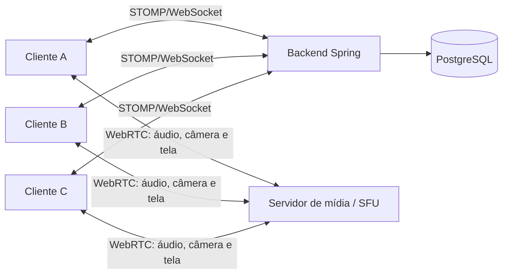
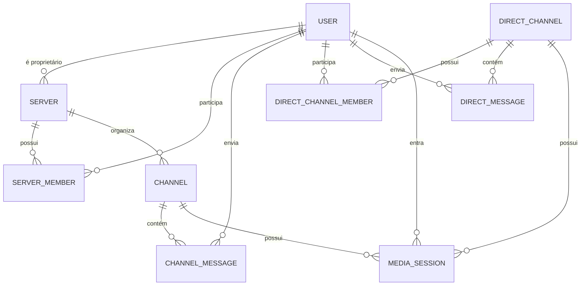

# LiveChat — visão do produto e direção técnica

Este documento é a referência viva para a evolução do LiveChat. Ele descreve o que existe hoje, o produto que queremos construir e as decisões que ainda precisam ser tomadas. Deve ser atualizado sempre que uma decisão de arquitetura ou de experiência mudar.

## Objetivo

Evoluir o backend atual para sustentar uma plataforma de comunicação em tempo real inspirada no uso de servidores e canais do Discord. O produto terá duas formas de conversa: servidores, que funcionam como grupos organizados em canais, e canais privados 1:1. Ambas suportarão mensagens e comunicação em tempo real por áudio, câmera e compartilhamento de tela.

O produto não precisa reproduzir todos os recursos do Discord. A intenção inicial é ter uma experiência simples e sólida de comunidades privadas: criar servidor, convidar ou adicionar membros, organizar canais e conversar com mídia em tempo real, inclusive em privado entre duas pessoas. A primeira versão é dimensionada para canais 1:1 e para até 5 participantes simultâneos em um canal de servidor.

## O que já existe

O projeto é uma aplicação Java 21 com Spring Boot 3.5, PostgreSQL, JPA, Spring Security, JWT e WebSocket/STOMP. Docker Compose sobe a aplicação e o banco.

As funcionalidades atuais são:

- cadastro, login, JWT de acesso e refresh token;
- consulta e exclusão da própria conta;
- solicitações de amizade e lista de amigos;
- mensagens privadas persistidas entre dois usuários;
- WebSocket nativo em `/ws`, com STOMP e autenticação por `Authorization: Bearer <JWT>` no frame `CONNECT`;
- envio de mensagem para `/app/chat` e recebimento privado em `/user/queue/messages`.
- servidores com proprietário e membros;
- canais de servidor dos tipos `TEXT` e `VOICE`;
- convites direcionados a amigos aceitos, com aceite explícito do destinatário.
- canais privados 1:1 permanentes, com criação idempotente, listagem e consulta limitada aos dois participantes.

Ainda não há mensagens vinculadas a canais, presença de mídia ou chamadas de áudio, câmera e tela.

## Experiência desejada

1. Uma pessoa autenticada cria um **servidor** e se torna sua proprietária.
2. Ela cria canais dos tipos **voz** e **texto**.
3. Outras pessoas entram no servidor por um link de convite e confirmam que desejam participar.
4. Um membro seleciona um canal de voz e entra nele.
5. Os demais membros daquele canal recebem a mudança de presença e passam a ouvir e ver as mídias publicadas, com entrada e saída sem recarregar a página.
6. O membro pode ligar ou desligar câmera, silenciar o microfone, compartilhar uma tela ou janela e controlar os dispositivos de entrada e saída.
7. O membro pode sair do canal ou trocar de canal a qualquer momento.
8. Duas pessoas podem abrir ou retomar um **canal privado 1:1**, trocar mensagens e iniciar uma conversa de áudio, câmera ou tela sem criar ou entrar em um servidor.

Na primeira versão, as permissões podem ser simples: proprietário e membro. Papéis, cargos, moderação, gravação e vídeo em alta escala ficam fora do escopo inicial.

## Decisões consolidadas

| Tema | Decisão |
| --- | --- |
| SFU | Usar **LiveKit auto-hospedado**. O servidor é open source sob licença Apache 2.0 e atende áudio, câmera, tela, salas e credenciais de acesso. Não haverá custo de licença ou de serviço gerenciado. |
| Custo de mídia | O software será gratuito, mas a operação em produção exigirá hospedagem, IP público, domínio/TLS e consumo de banda. Em desenvolvimento, LiveKit pode rodar localmente sem custo. |
| Entrada no servidor | Um membro convida diretamente um amigo com amizade aceita. O destinatário lista o convite e confirma a ação em “Aceitar convite”. Apenas essa confirmação adiciona a pessoa ao servidor. |
| Canal de mídia ativo | Cada usuário pode participar de somente um canal de voz por vez. Ao entrar em outro canal, o sistema sai do anterior de forma atômica. |
| Reconexão | A presença será preservada por 30 segundos após uma desconexão inesperada. Se o usuário retornar ao mesmo canal nesse prazo, a sessão será reativada; passado o prazo, a saída será definitiva. |
| Redis | Será incluído junto com a camada de mídia. Ele manterá sessões de mídia e reconexão com TTL de 30 segundos e poderá servir ao modo distribuído do LiveKit quando necessário. |
| Canais privados 1:1 | São conversas permanentes entre exatamente dois usuários, independentes de um servidor. Elas permitem mensagens, áudio, câmera e compartilhamento de tela em tempo real. Somente os dois participantes podem acessá-las. |
| Canais de texto | Fazem parte do modelo de servidor desde o início. As mensagens privadas atuais serão remodeladas como mensagens de canal privado 1:1; mensagens de grupos serão vinculadas a canais de texto do servidor. |

## Conceitos de domínio

| Conceito | Responsabilidade |
| --- | --- |
| Usuário | Conta autenticada já existente no sistema. |
| Servidor | Espaço criado por um usuário que reúne membros e canais. Possui nome, proprietário e data de criação. |
| Membro do servidor | Vínculo entre usuário e servidor. Na primeira versão, guarda o papel de proprietário ou membro. |
| Convite | Registro direcionado a um amigo aceito, contendo servidor, remetente, destinatário e estado. Ele permite ingressar no servidor somente após a aceitação explícita do destinatário. |
| Canal | Recurso pertencente a um servidor. Terá nome, posição e tipo (`VOICE` ou `TEXT`). Um canal de voz comporta áudio, câmera e compartilhamento de tela; um canal de texto reúne mensagens persistidas. |
| Canal privado 1:1 | Conversa identificada por dois participantes únicos. Contém suas mensagens e mapeia para uma sala de mídia exclusiva enquanto uma chamada estiver ativa. |
| Sessão de mídia | Presença efêmera de um membro em um canal de voz. Não armazena áudio, vídeo ou tela; registra quem está conectado e o estado das mídias publicadas. |
| Mensagem | Conteúdo de texto persistido em um canal de texto de servidor ou em um canal privado 1:1, com autor e instante de envio. |

## Como a mídia em tempo real deve funcionar

O WebSocket atual é adequado para eventos pequenos e imediatos, como presença e sinalização, mas não para transportar áudio, câmera ou tela continuamente. A chamada deve usar **WebRTC**, que captura as mídias no cliente, negocia conexões seguras e as transmite com baixa latência.

Mesmo com o limite de cinco pessoas, a arquitetura indicada é uma **SFU** (*Selective Forwarding Unit*). Cada cliente envia uma única faixa de cada mídia publicada para a SFU; ela encaminha as faixas aos demais participantes do canal. Isso mantém o envio do navegador previsível quando alguém ativa câmera ou compartilha a tela e evita uma malha peer-to-peer, em que cada participante precisa enviar cópias da mesma mídia a todos os demais.

Responsabilidades previstas:

- **Backend Spring:** autenticação, autorização, persistência de servidores e canais, emissão de credenciais de mídia, presença e eventos do produto.
- **SFU:** encaminhamento de áudio, câmera e tela por WebRTC. Ela não substitui as regras de acesso do backend.
- **Cliente:** interface, captura do microfone, câmera e tela, conexão WebRTC com a SFU e reprodução das faixas remotas.
- **PostgreSQL:** dados duráveis do produto; sessões de mídia ativas não precisam ser gravadas como histórico nesta primeira versão.

O LiveKit auto-hospedado é a SFU escolhida para o MVP. Ele reduz a complexidade operacional de implementar protocolos WebRTC e RTP diretamente no backend Java e permite limitar a qualidade de cada faixa conforme o contexto. O servidor é gratuito para usar; os custos inevitáveis ficam restritos à infraestrutura própria que o hospeda e à banda consumida pelas chamadas.

### Meta de latência e qualidade inicial

O produto prioriza interatividade, não gravação ou qualidade máxima. Uma meta de **50 ms ponta a ponta** para toda chamada não é garantível na internet pública: a mídia precisa percorrer cliente → SFU → cliente, além de captura, codificação, buffer contra variações de rede e reprodução. Ela só seria plausível quando todos os participantes e a SFU estivessem muito próximos em uma rede excepcional.

O compromisso inicial será mensurado em três níveis:

| Medida | Meta inicial | Escopo |
| --- | --- | --- |
| RTT cliente ↔ SFU | até 50 ms no percentil 50 | Participantes próximos à região da SFU, em rede saudável. |
| Áudio captura → reprodução | até 100 ms no percentil 50; até 180 ms no percentil 95 | Dois a cinco participantes, sem perda de pacotes relevante. |
| Câmera e tela captura → exibição | até 200 ms no percentil 50; até 350 ms no percentil 95 | Dois a cinco participantes, em rede saudável. |

Os 50 ms passam, portanto, a ser uma meta de proximidade entre cliente e SFU, que é controlável pela infraestrutura. A latência ponta a ponta será observada separadamente e terá uma meta compatível com a cadeia completa de mídia. Métricas deverão ser coletadas no cliente por meio das estatísticas do WebRTC, incluindo RTT, jitter, perda de pacotes, bitrate e atraso de jitter buffer.

Para manter essa prioridade na primeira versão:

- transmitir áudio, câmera e tela via WebRTC, sem passar mídia pelo backend Spring;
- hospedar a SFU na região mais próxima dos usuários esperados — São Paulo é o ponto inicial se os participantes estiverem no Brasil — e usar STUN/TURN para viabilizar conexões em redes restritivas;
- enviar apenas as faixas que o participante ativar: áudio é esperado, câmera e tela são opcionais;
- permitir no máximo uma câmera e um compartilhamento de tela publicados por pessoa;
- iniciar com vídeo de câmera em qualidade moderada e adaptar a qualidade à rede; a tela prioriza legibilidade;
- não gravar, retransmitir nem processar mídia no servidor durante o MVP.

## Contrato de tempo real proposto

O endpoint `/ws` poderá continuar como o canal STOMP de controle. Após validar que o usuário é membro do servidor, o backend publicará eventos privados ou por canal, por exemplo:

- `media.participant.joined`
- `media.participant.left`
- `media.participant.updated` — microfone, câmera ou tela ativados/desativados;
- `server.channel.created`
- `server.member.joined`

Entrar em um canal de voz será uma operação autenticada do backend, não apenas uma conexão direta do cliente à SFU. O fluxo esperado é:

1. o cliente pede para entrar no canal;
2. o backend verifica JWT, servidor, membro e permissões;
3. o backend cria ou atualiza a sessão de mídia e emite uma credencial de curta duração para a sala correspondente ao canal;
4. o cliente usa essa credencial para conectar-se à SFU por WebRTC;
5. o backend notifica a presença pelo WebSocket;
6. ao sair de forma voluntária, a sessão é removida e o evento é publicado;
7. em uma queda inesperada, a sessão recebe um TTL de 30 segundos no Redis e o participante fica no estado `reconnecting`;
8. se o cliente voltar ao mesmo canal nesse prazo, o backend reativa a sessão; após o TTL, publica a saída definitiva.

O backend deve sempre conferir a participação no servidor antes de expor um canal, emitir uma credencial de mídia ou publicar eventos de presença. A SFU deve receber permissões que permitam publicar e assinar apenas a sala daquele canal.

Para um canal privado 1:1, a mesma regra se aplica aos seus dois participantes: o backend só emite a credencial da sala de mídia e entrega mensagens quando o usuário autenticado pertence àquela conversa. A sala do LiveKit deve ter um identificador diferente do usado por qualquer canal de servidor.

## Modelo inicial de dados

Entidades sugeridas para a primeira implementação:

- `Server`: `id`, `name`, `owner`, `createdAt`;
- `ServerMember`: `id`, `server`, `user`, `role`, `joinedAt`, com unicidade para `server + user`;
- `Channel`: `id`, `server`, `name`, `type` (`VOICE` ou `TEXT`), `position`, `createdAt`;
- `ChannelMessage`: `id`, `channel`, `author`, `content`, `createdAt`; só pode ser criada em canais `TEXT` por membros do servidor;
- `DirectChannel`: `id`, `participantOne`, `participantTwo`, `createdAt`, com unicidade para o par de usuários, independentemente da ordem;
- `DirectMessage`: `id`, `directChannel`, `author`, `content`, `createdAt`; só pode ser criada por um dos dois participantes;
- `ServerInvite`: `id`, `server`, `inviter`, `invitee`, `status`, `createdAt`, `acceptedAt`, com unicidade para `server + invitee`;
- `MediaSession`: estado efêmero no Redis, associado a um canal de voz de servidor ou a um canal privado 1:1. Durante uma reconexão, possui TTL de 30 segundos. Deve conter ao menos `channel`, `user`, `joinedAt`, `microphoneEnabled`, `cameraEnabled`, `screenShareEnabled`, `status` e `lastSeenAt`.

As mensagens privadas existentes representam conversas diretas entre dois usuários, mas não possuem atualmente uma entidade de canal privado 1:1. A remodelagem as vinculará a `DirectChannel`. As mensagens de servidor serão uma estrutura distinta e vinculada a `Channel`, evitando que uma mensagem privada seja exposta ao servidor.

## Primeiras entregas

### Marco 1 — servidores e canais

- criar, listar e consultar servidores aos quais o usuário pertence;
- criar e listar canais de voz e texto dentro de um servidor;
- registrar proprietário como primeiro membro;
- criar um link de convite, consultar seus dados sem alterar o servidor e aceitar o convite explicitamente;
- criar ou recuperar um canal privado 1:1 e garantir que só seus participantes possam consultá-lo;
- remodelar as mensagens para persistir e listar mensagens por canal de texto ou canal privado 1:1;
- garantir autorização de membro em todas as rotas.

### Marco 2 — presença de mídia

- entrar, sair e trocar de canal;
- expor participantes atuais do canal;
- publicar eventos STOMP de presença;
- registrar a desconexão inesperada como `reconnecting` e preservar a sessão por 30 segundos no Redis;
- remover a sessão e publicar a saída quando o TTL expirar.

### Marco 3 — áudio, câmera e tela por WebRTC

- subir e configurar o LiveKit auto-hospedado;
- criar a sala de mídia associada ao canal de voz;
- criar a sala de mídia exclusiva para cada canal privado 1:1 quando uma chamada for iniciada;
- emitir token de acesso de curta duração após a autorização no backend;
- conectar o cliente à sala, publicar microfone e receber as faixas remotas;
- publicar e interromper a câmera;
- compartilhar e interromper o compartilhamento de tela ou janela;
- suportar silenciar e reativar o microfone;
- validar a chamada com 2 e com 5 participantes simultâneos.

## Critérios de qualidade do MVP

- nenhuma pessoa sem vínculo com o servidor consegue obter credencial ou presença de um canal daquele servidor;
- uma entrada, saída ou mudança de canal aparece aos membros conectados sem atualização da página;
- participantes de um canal privado 1:1 e de um canal de voz de servidor conseguem conversar por áudio, câmera e compartilhamento de tela em navegadores comuns;
- participantes próximos à SFU atingem RTT cliente ↔ SFU de até 50 ms no percentil 50;
- a chamada de 2 a 5 participantes atinge as metas de áudio e vídeo descritas neste documento em condições de rede saudáveis;
- o encerramento do navegador, WebSocket ou sessão remove a presença em prazo previsível;
- uma desconexão inesperada permite reconectar-se ao mesmo canal por até 30 segundos sem uma nova entrada visível aos demais membros;
- os dados duráveis do servidor, membros e canais permanecem consistentes no PostgreSQL;
- a documentação OpenAPI e o contrato de eventos são atualizados junto com cada endpoint novo.

## Próximo passo sugerido

Remodelar as mensagens privadas existentes para vinculá-las aos canais privados 1:1. Em seguida, implementar mensagens persistidas nos canais `TEXT` de servidor, sempre reutilizando as verificações de participação já estabelecidas.

O fluxo de convite já é direcionado a um amigo aceito e exige aceite explícito, mas o backend ainda não emite um token ou URL de convite próprio. Esse é um refinamento separado para que o cliente possa compartilhar um link sem depender do identificador interno do convite.
